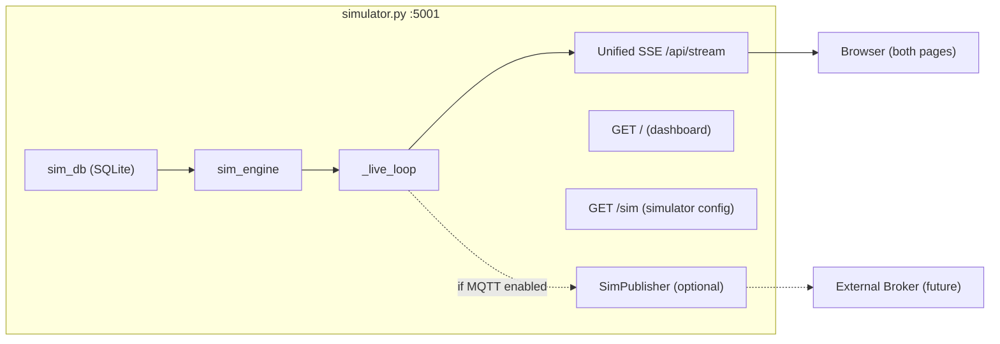

# Simplify Architecture: Merge into Single App

## Problem

The current system runs **two FastAPI processes** that share the same DB and `app/` package, connected by **three redundant data paths** (MQTT, HTTP proxy, SSE proxy). This creates:

- Monkey-patching of `_broadcast` in [broker_dashboard.py](broker_dashboard.py) (line 228)
- Duplicated stability score logic in [broker_dashboard.py](broker_dashboard.py) (lines 58-76) vs [sim_engine.py](app/sim_engine.py) (lines 320-326)
- Duplicate SSE queue systems in both apps
- Dashboard fetching appliance names via HTTP because it can't access the DB directly (even though it can -- they share `app/sim_db.py`)
- An embedded MQTT broker + subscriber just to relay data within the same machine

## Target Architecture

**Single process, single port, one SSE stream, one source of truth.**

## Changes by File

### 1. [simulator.py](simulator.py) -- Merge dashboard features in

- Add dashboard page route (`GET /` for dashboard, `GET /sim` for configurator) or use a single SPA-style page with tabs
- Move dashboard's in-memory history buffers (`battery_history`, `solar_history`, `appliance_history`, `appliance_meta`, `latest`) into `_sim_state` or a dedicated `DashboardState` class
- Consolidate the two SSE systems (`_sse_queues` in simulator + `_sse_queues` in dashboard) into one
- Move dashboard REST endpoints (`/api/status`, `/api/history/`*, `/api/stability`) into the existing `api` router
- Remove the `start_subscriber()` call from lifespan -- the live loop already has the data
- Remove `start_broker()` from lifespan

### 2. [broker_dashboard.py](broker_dashboard.py) -- Delete

- All functionality moves into `simulator.py`
- The `_seed_appliance_meta()` HTTP fetch becomes unnecessary (same process can read DB directly)
- The `sim-stream-proxy` SSE proxy becomes unnecessary (same process)
- The monkey-patch on `_broadcast` is eliminated
- The duplicated `_compute_si()` is eliminated (use the engine's score directly)

### 3. [app/mqtt_service.py](app/mqtt_service.py) -- Simplify to optional publisher only

- **Keep**: `SimPublisher` class (lines 79-201) -- needed for future external MQTT integration
- **Remove**: `start_broker()` / `_keep_broker_alive()` (embedded amqtt broker)
- **Remove**: `start_subscriber()` / `stop_subscriber()` (paho subscriber)
- **Remove**: `_dashboard_queues`, `add_dashboard_queue`, `remove_dashboard_queue`, `_broadcast`
- Result: ~80 lines down from ~257 lines

### 4. Templates

- [templates/dashboard.html](templates/dashboard.html) -- Update SSE endpoint from `/api/stream` to the unified endpoint, remove `simulator_url` references
- [templates/simulator.html](templates/simulator.html) -- Minor: adjust navigation links if page routes change

### 5. No changes needed

- [app/sim_engine.py](app/sim_engine.py) -- Already clean, no coupling to MQTT or dashboard
- [app/sim_db.py](app/sim_db.py) -- Already clean

### 6. [docker-compose.yml](docker-compose.yml)

- Remove the separate `dashboard` service
- Single container serves everything on one port

## What stays for future MQTT

- `SimPublisher` remains in `mqtt_service.py` as a clean, optional component
- The `mqtt_settings` DB table stays
- The MQTT settings UI stays in the simulator page
- When MQTT is toggled on, the live loop calls `publisher.publish_step()` as a side-effect
- When an external broker is available, `SimPublisher.connect()` targets it directly (no embedded broker needed)

## Complexity reduction

- **Files**: 5 Python files --> 4 (delete `broker_dashboard.py`)
- **Processes**: 2 --> 1
- **Data paths**: 3 --> 1 (direct SSE)
- **SSE systems**: 2 --> 1
- **mqtt_service.py**: ~257 lines --> ~80 lines
- **Eliminated**: monkey-patching, embedded broker, subscriber, HTTP proxy, SSE proxy, duplicate SI formula

